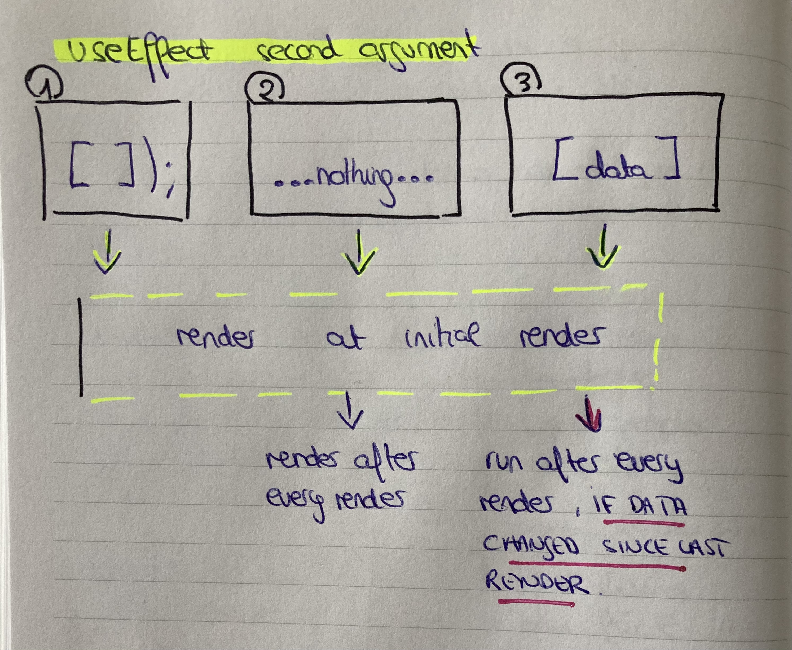

### useEfect 

    - It is a function that take 2 arguments
        - First argument -> is a function(callback) to be executed(run)
        - Second argument -> are the properties that to observe in order to execute.

```jsx

import React, { useState, useEffect } from 'react';

useEffect(() => {
    //first argument
    console.log("in useEffect are effects that have nothing to do with rendering.");
}, /*second argument (no object, no function)*/ );

// second argument
,  ); // when the component is render the first time only
, [ ]); // when the component is rendered for the first time and whenever it rerenders
, [data]); // when the component is rendered for the first time and whenever it rerenders and some pieces of data has changed.


```

